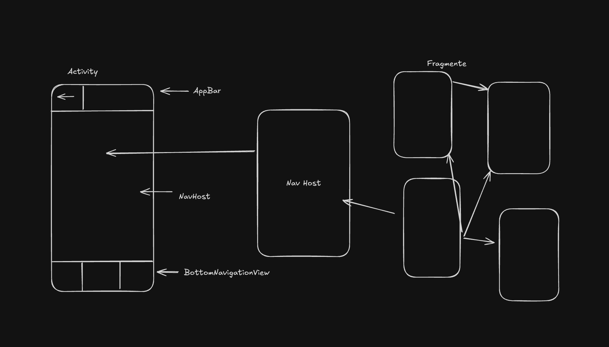
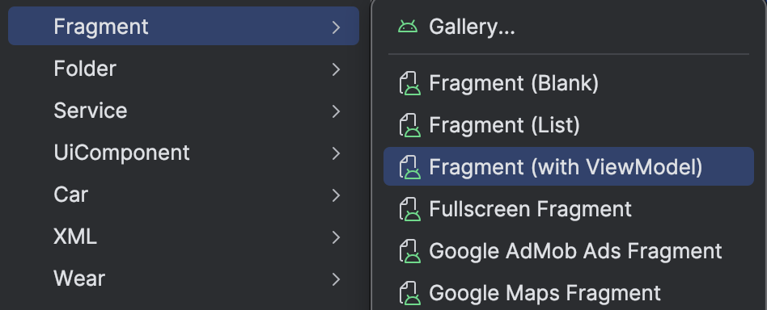

Wir werden unsere App aus einer leeren Activity zu einer Single Activity App mit Bottom und Top Bar sowie einem zentralen NavHost aufbauen. 

Dazu muss man verstehen wie die App aufgebaut sein wird.
Hier ist eine einfache Zeichnung mit der Activity die oben eine AppBar, unten eine BottomNavigationBar und dazwischen ein Navigation Host enthält.
Der NavHost wird unsere Fragmente hosten die den Großteil der App darstellen werden. Weiterhin hilft uns der NavHost dabei von zwischen diesen Fragmenten hin und her zu wechseln 


## Fragmente

Zuerst erstellen wir zwei Fragmente. Ein `HomeFragment` und ein `SettingsFragment` am besten wählen wir `Fragment (with ViewModel)`aus. Wir werden das ViewModel in den späteren Tutorials benötigen. 

Ändert dann die Text Inhalte der Fragmente damit wir diese visuell Unterscheiden können.

## Navigation
Damit wir navigieren können benötigen wir einen Navigationsgraphen. In dem Graphen ist es wichtig die StartDestination anzugeben und die Fragmente die an der Navigation beteiligt sind.
Des weiteren gibt man die Actions an die die Navigation von einem Fragmenten zum Anderen definieren.
```xml
<?xml version="1.0" encoding="utf-8"?>  
<navigation xmlns:android="http://schemas.android.com/apk/res/android"  
    xmlns:app="http://schemas.android.com/apk/res-auto"  
    xmlns:tools="http://schemas.android.com/tools"  
    android:id="@+id/main_nav"  
    app:startDestination="@id/homeFragment">  
    <fragment        
	    android:id="@+id/homeFragment"  
        android:name="de.dmitrij.patuk.myapp.ui.home.HomeFragment"  
        android:label="fragment_home"  
        tools:layout="@layout/fragment_home" >  
        <action            
	        android:id="@+id/action_homeFragment_to_settingsFragment"  
            app:destination="@id/settingsFragment" />  
    </fragment>    
    
    <fragment        
	    android:id="@+id/settingsFragment"  
        android:name="de.dmitrij.patuk.myapp.ui.settings.SettingsFragment"  
        android:label="fragment_settings"  
        tools:layout="@layout/fragment_settings"  
        >  
        <action           
	        android:id="@+id/action_settingsFragment_to_homeFragment"  
            app:destination="@id/homeFragment" />  
    </fragment>    
</navigation>
```

## Menu
Die BottomNavigationView benötigt ein Menu lege eine Datei `main_nav_menu.xml` im `res/menu`Verzeichnis an. Diese Datei definiert wie das Menu aussieht.
```xml
<?xml version="1.0" encoding="utf-8"?>  
<menu xmlns:android="http://schemas.android.com/apk/res/android">  
    <item        
	    android:id="@+id/home_menu"  
        android:icon="@drawable/sharp_add_home_24"  
        android:title="@string/home"  
        />  
    <item        
	    android:id="@+id/settings_menu"  
        android:icon="@drawable/sharp_add_home_24"  
        android:title="@string/settings"  
        />  
</menu>
```

## MainActivity.xml
Somit sieht der Aufbau folgendermaßen aus. Wie bereits oben beschrieben. `AppBarLayout`, `FragmentContainerView` als `NavHostFragment` und `BottomNavigationView` um die wichtigsten Navigation Actions zu definieren.
```xml
<?xml version="1.0" encoding="utf-8"?>  
<LinearLayout  
    xmlns:android="http://schemas.android.com/apk/res/android"  
    xmlns:app="http://schemas.android.com/apk/res-auto"  
    xmlns:tools="http://schemas.android.com/tools"  
    android:id="@+id/main"  
    android:layout_width="match_parent"  
    android:layout_height="match_parent"  
    tools:context=".MainActivity"  
    android:orientation="vertical"  
    >  
  
    <com.google.android.material.appbar.AppBarLayout        
	    android:layout_width="match_parent"  
        android:layout_height="wrap_content">  
        <com.google.android.material.appbar.MaterialToolbar            
	        android:layout_width="match_parent"  
            android:layout_height="wrap_content"  
            app:titleCentered="true" />  
    </com.google.android.material.appbar.AppBarLayout> 
     
    <androidx.fragment.app.FragmentContainerView        
	    android:id="@+id/nav_host_fragment"  
        android:name="androidx.navigation.fragment.NavHostFragment"  
        android:layout_width="match_parent"  
        android:layout_height="0dp"  
        android:layout_weight="1"  
        app:defaultNavHost="true"  
        app:navGraph="@navigation/main_nav"  
        />  
  
	<com.google.android.material.bottomnavigation.BottomNavigationView       
	    android:id="@+id/bottom_nav"  
        android:layout_width="match_parent"  
        android:layout_height="wrap_content"  
        app:menu="@menu/main_nav_menu"  
        />  
</LinearLayout>
```

## MainActivity.java
Dazu gehört die MainActivity Klasse. Hier wird der `NavController`sowie die `BottomNavigationView` initialisiert. 
```java
  
public class MainActivity extends AppCompatActivity {  
    private NavController navController;  
    @Override  
    protected void onCreate(Bundle savedInstanceState) {  
        super.onCreate(savedInstanceState);  
        EdgeToEdge.enable(this);  
        setContentView(R.layout.activity_main);  
        ViewCompat.setOnApplyWindowInsetsListener(
	        findViewById(R.id.main), (v, insets) -> {  
	            Insets systemBars = 
		            insets.getInsets(WindowInsetsCompat.Type.systemBars());  
		            v.setPadding(
			            systemBars.left, 
			            systemBars.top, 
			            systemBars.right, 
			            systemBars.bottom);  
            return insets;  
        });  
  
        // Set up BottomNavigationView to react to presses  
        BottomNavigationView bottomNav = findViewById(R.id.bottom_nav);  
        bottomNav.setOnItemSelectedListener(this::onNavItemSelected);  
		
		//Set up NavHostFragment to host the Navigation
        NavHostFragment navHostFragment = 
        (NavHostFragment) getSupportFragmentManager()  
		        .findFragmentById(R.id.nav_host_fragment);  
        navController = navHostFragment.getNavController();  
    }  
  
    private boolean onNavItemSelected(MenuItem menuItem) {  
        if (menuItem.getItemId() == R.id.settings_menu) {
	        //navigiere zu der angegebenen NavigationsAction ID
	        navController.navigate(
		        R.id.action_homeFragment_to_settingsFragment
			);  
			//return true if handled
            return true;  
        }  
        if (menuItem.getItemId() == R.id.home_menu) {  
	        //navigiere zu der angegebenen NavigationsAction ID
            navController.navigate(
	            R.id.action_settingsFragment_to_homeFragment
			);  
            return true;  
        } 	
		//return false if not handled 
        return false;  
    }  
}
```

## Abschluss
Somit sollte man die App jetzt starten können und von einem Screen in den anderen Navigieren über die Buttons in der `BottomNavigationView`