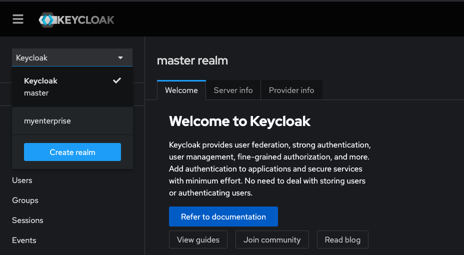
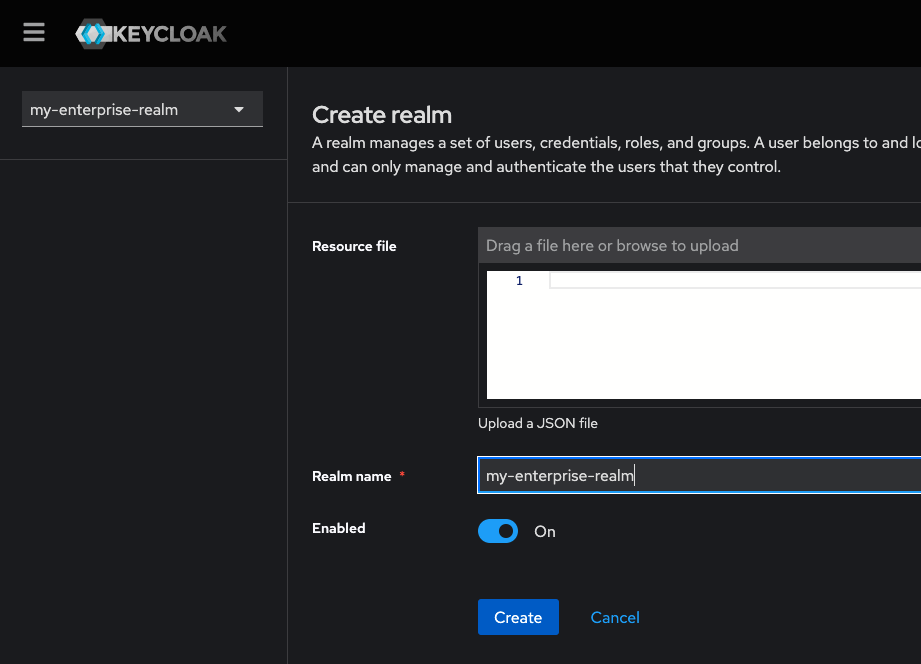
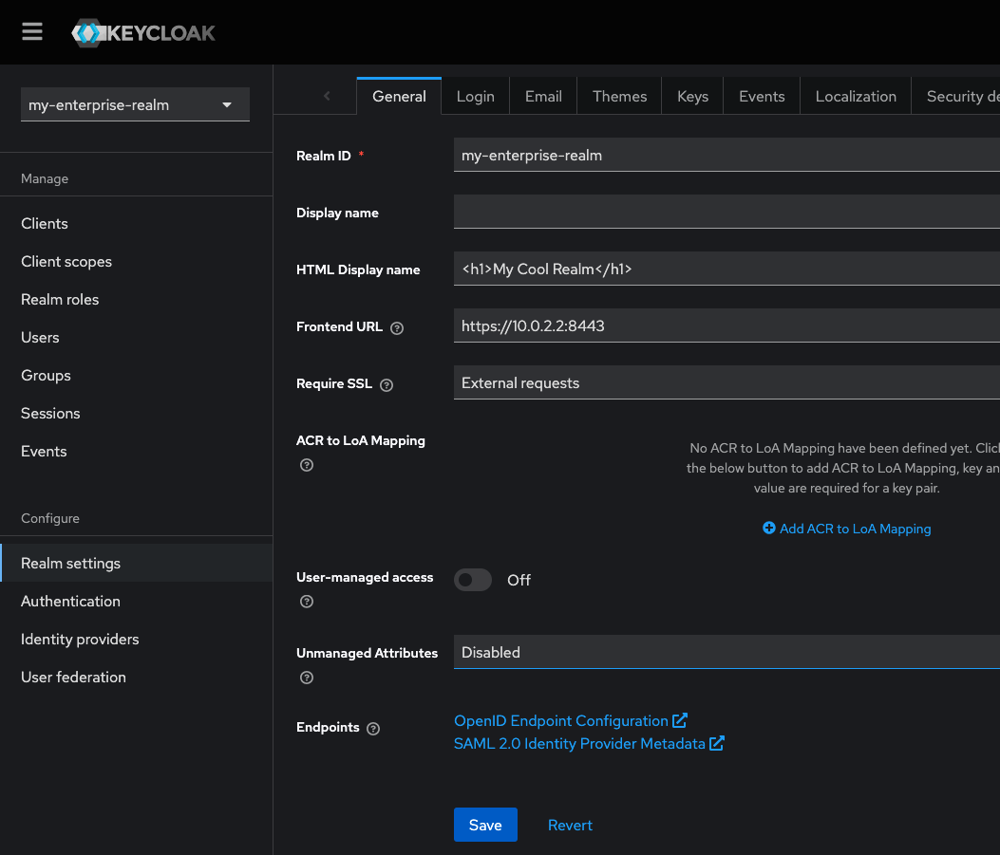
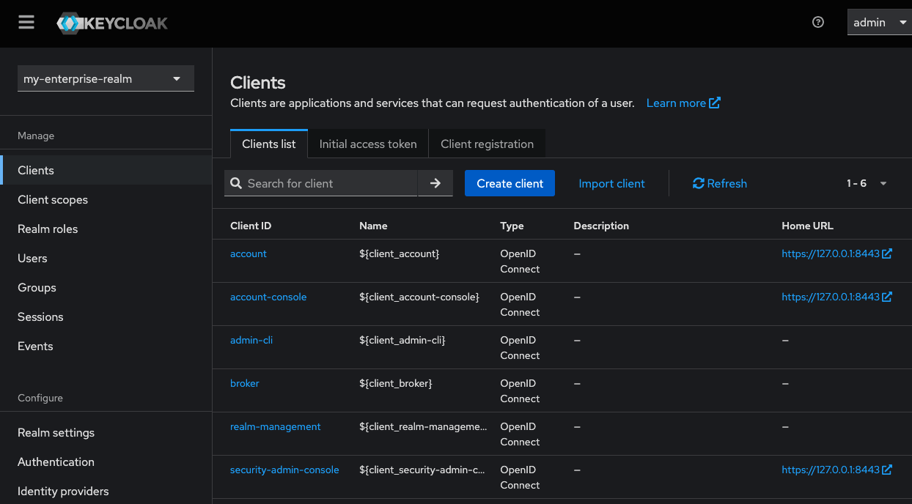
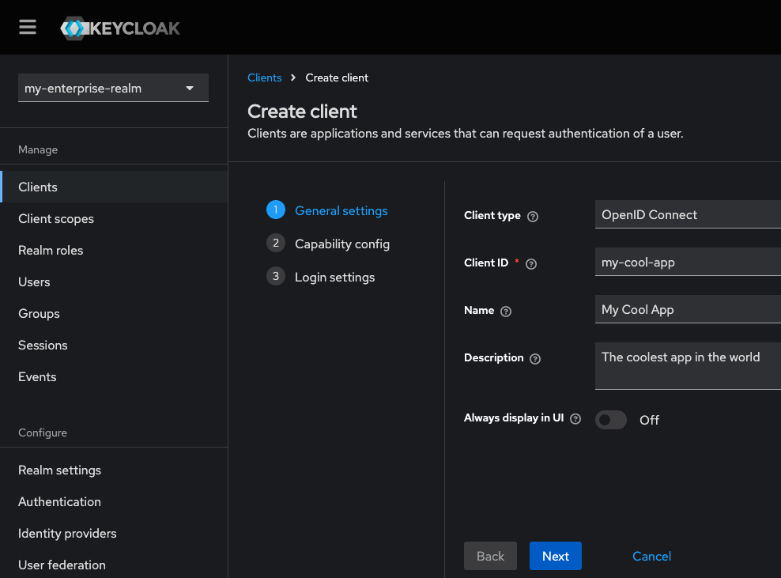
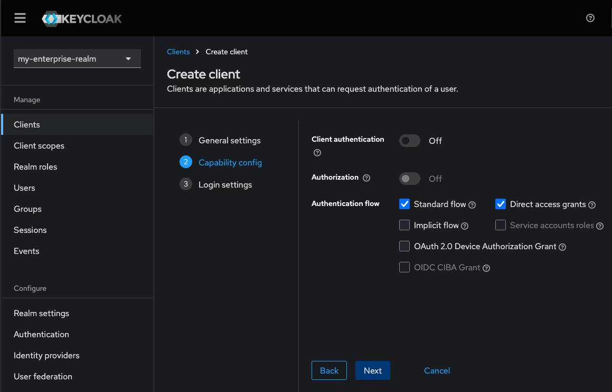
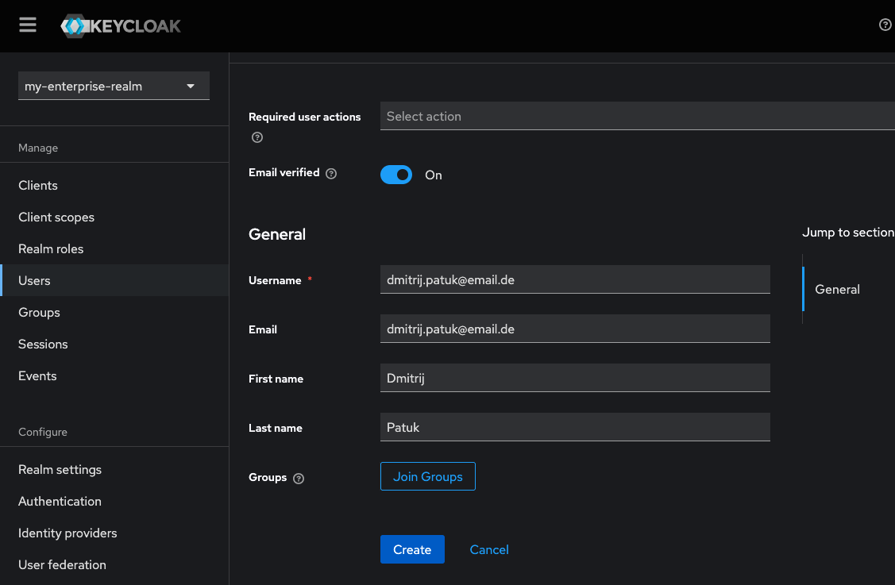
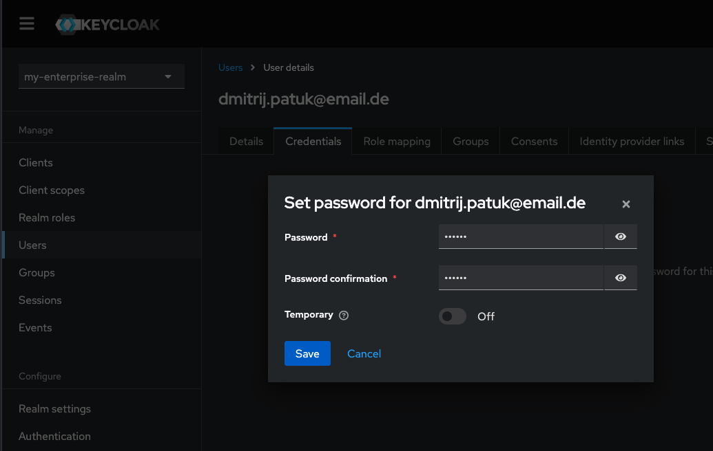

# Android SSO mit Keycloak


In diesem Tutorial werden wir unsere Android App für Single Sign On (SSO) konfigurieren.

## Anforderungen

- Docker
- openssl

## Keycloak

Als erstes richten wir uns ein Authentication Server ein. Wir verwenden den Keycloak weil dieser relativ einfach und schnell einzurichten ist. Wir benötigen dafür nur `Docker` um die Anwendung zu hosten und `openssl` um die für HTTPS benötigten Zertifikate generieren zu können. 

https://www.keycloak.org/


### Zertifikate

Android und die für die Authentifizierung verwendete Bibliothek setzen `HTTPS`voraus deshalb müssen wir erstmal die Benötigten Zertifikate erstellen.

Erstellt ein Verzeichnis im Root eures Android Projektes und betreten dieses
```bash
mkdir -p keycloak-cert
cd keycloak-cert
```

Danach müssen wir eine `san.cnf`Datei in diesem Verzeichnis erstellen.
```bash
touch san.cnf
```

Betretet die Datei und fügt den Nachfolgenden Code ein.
```bash
[ req ]  
default_bits       = 2048  
distinguished_name = req_distinguished_name  
req_extensions     = req_ext  
prompt             = no  
  
[ req_distinguished_name ]  
C = DE  
ST = Baden Wuerttemberg  
L = Mannehim  
O = My Cool App COrp  
OU = Team My Cool App  
CN = 10.0.2.2  
  
[ req_ext ]  
subjectAltName = @alt_names  
  
[ alt_names ]  
IP.1 = 10.0.2.2
```
Die `san.cnf` Datei wird als input für `openssl` verwendet und enthält die Konfiguration für das Zertifikat das wir erstellen wollen.
Wichtig ist die Zeile `CN = 10.0.2.2`. Dies ist die IP unter der unser Keycloak von der Android VM aus erreichbar sein wird. Der Emulator stellt uns diese Automatisch zur verfügung. Es ist das `localhost` des Hosts auf dem `Android Studio` ausgeführt wird.

Weiterhin sind diese Zeilen für Android wichtig. Das `subjectAltName` wird von Android vorausgesetzt sonst lehnt es das Zertifikat ab und wir können uns nicht authentifizieren.
```bash
[ req_ext ]  
subjectAltName = @alt_names  
  
[ alt_names ]  
IP.1 = 10.0.2.2
```

Wenn wir die Datei erstellt haben führen wir folgenden Befehl in dem selben Verzeichnis aus.
```bash
# Generate self-signed certificate valid for 365 days
openssl req -x509 -nodes -days 365 -newkey rsa:2048 \
  -keyout keycloak.key \
  -out keycloak.crt \
  -config san.cnf \
  -extensions req_ext
```
Damit erstellen wir das Zertifikat und die Keyfile die von Keycloak für das Bereitstellen des `HTTPS`Endpunkts verwendet werden.


Danach erstellen wir direkt das Zertifikat für Android mit folgendem Befehl
```
openssl x509 -in keycloak.crt -out keycloak.der -outform DER
```

### Keycloak Docker Container

Wir werden Keycloak über folgende Docker Compose Konfiguration bereitstellen.
Bitte erstellt die `docker-compose.yml` außerhalb des vorher erstellten `keycloak-cert` Verzeichnisses.
```yaml
version: "3.8"

services:
  keycloak:
    image: quay.io/keycloak/keycloak:25.0.2
    container_name: keycloak-https
    command:
      - start-dev
      - --https-certificate-file=/opt/keycloak/certs/keycloak.crt
      - --https-certificate-key-file=/opt/keycloak/certs/keycloak.key
      - --https-port=8443
    environment:
      - KEYCLOAK_ADMIN=admin
      - KEYCLOAK_ADMIN_PASSWORD=admin
    volumes:
      - ./keycloak-cert:/opt/keycloak/certs
    ports:
      - "8443:8443"
```
Beachtet das volume. Damit binden wir das Verzeichnis mit den Zertifikaten ein und führen mit `command` Die Befehle zum laden der Zertifikate. Die `ports` definieren den HTTPS Port von Keycloak.
Startet die Compose mit `docker compose up` und navigiert zu `https://127.0.0.1:8443/` Ihr solltet das Loginfenster vom Keycloak sehen. 
Bitte prüft das Zertifikat dieser Webseite. Es sollte die beim Erstellen des Zertifikats angegebenen Properties enthalten. Wenn diese nicht enthalten sind müsst ihr die vorherigen Schritte wiederholen. Denn die Authentifizierung wird nicht funktionieren. 

Akzeptiert das Zertifikat und Meldet euch mit den in den compose definierten Zugangsdaten ein. 

## Keycloak Konfiguration

Da Keycloak jetzt lauft und mit dem richtigen Zertifikat konfiguriert ist, müssen wir ein `Realm`, `Client` und `User` erstellen, damit wir uns aus unserer App gegen das System authentifizieren können.

### Realm 
Als erstes erstellen wir ein `Realm` ein Realm ist ein Bereich innerhalb dessen wir Anwendungen, Benutzer, Gruppen, Rollen definieren können die die Authentifizierungstoken untereinander austauschen können so das wir uns nur ein Mal anmelden müssen.

Dazu gehen wir auf das DropDown Feld in der linken SideBar in der `Keycloak` steht und wählen `Create realm` aus. 


Wir tragen einen `Realm name` z.B.: `my-enterprise-realm` ein und merken uns diesen. Dieser wird später wichtig sein Ein Klick auf `Create` erstellt diesen



Wir stellen sicher das unser Realm nach dem Klick auf `Create` in der Dropbox ausgewählt ist. 

Wir müssen noch `https://10.0.2.2:8443` als `Frontend URL` in den `Realm Settings` eintragen. Dies sorgt dafür das der Aufruf aus unserer App gegen den Keycloak funktioniert.
Klick auf `Save` nicht vergessen. Dies ist die URI die unsere App aufrufen wird. Sie wird vom Android Emulator bereit gestellt und symbolisiert unseren Host auf dem der Emulator lauft. 
)
### Client
Als nächstes erstellen wir ein Client der unsere Anwendung repräsentiert für die wir die Authentifizierung vornehmen wollen.

Dazu wählen wir in der Sidebar `Clients` aus, dabei sicher stellen das in der DropBox oberhalb der richtige `Realm` ausgewählt ist.


Wir klicken auf `Create client` und füllen das Formular aus.


Ein klick auf `Next`bringt uns zu einem Screen in dem wir die Authentification Flows auswählen können. Hier müssen wir nichts machen. Einfach wieder auf `Next` klicken.


Wir landen in den `Login settings`. Hier müssen wir eine `redirect URI` eintragen und die `Origin` sowie `post logout redirect Uri` Für die letzten beiden nehmen wir ein `*` und signalisieren damit das alles akzeptiert ist. 

Für `Valid redirect URIs`  tragen wir `de.dmitrij.patuk.myapp:/oauth2callback` ein. Dies wird der Einstiegspunkt in unsere App sein. Wenn Keycloak uns nach dem Authentifizieren weiter leitet wird der Android Browser diese `URI`sehen und unsere App öffnen.
Der Teil vor dem `:` ist frei belegbar. Er muss im Keycloak und später in der App aber der selbe sein. Danach auf `Save` klicken.


### Users
Wir haben jetzt ein `Realm` und ein `Client`, was uns noch fehlt ist ein `Benutzer` der sich gegen unseren `Client` auf unserem `Realm` authentifizieren kann.

Wir klicken auf `Users` in der linken Sidebar und dann auf `Create new user`, füllen das Formular aus, achten darauf das `Email verified` gesetzt ist und klicken danach auf `Create`


Innerhalb des neu erstellen Benutzers gehen wir auf den Reiter `Credentials` und `Set password` Tragen danach das Passwort ein, und merken es uns. Wir deaktivieren `Temporary` dieser Schalter sorgt dafür das ein Benutzer beim ersten Login ein neues Passwort vergeben muss. Wir brauchen das nicht. Danach ein klick auf `Save`  und `Save password`

Damit haben wir einen Benutzer erstellt

## Libraries und Plugins 

Nun sind wir endlich bereit uns der Android Seite zu widmen. Als erstes benötigen wir folgende Bibliotheken. Bitte bindet diese in eure Module `gradle` File.

### RX Java
https://github.com/ReactiveX/RxAndroid
RX Java ist eine Bibliothek die uns die Asynchrone Programmierung erleichtern wird. Sie hat eine sehr steile Lernkurve ist aber sehr hilfreich wenn es darum geht WebRequests oder Datenbank Requests in `IO` Threads auszuführen und danach auf dem `MainThread` weiter zu machen.
Wir werden sie später benötigen, wir importieren sie schon jetzt.
```kotlin
implementation("io.reactivex.rxjava3:rxandroid:3.0.2")
implementation("io.reactivex.rxjava3:rxjava:3.1.5")
```

### Dagger Hilt
https://dagger.dev/hilt/gradle-setup

Dagger Hilt übernimmt das Dependency Injection in unserer Android App. Es wird uns alle benötigten Abhängigkeiten automatisch erstellen und bereitstellen.

#### Dependencies
Als erstes wird der Plugin in der Project `gradle` File benötigt.
```kotlin
//Root gradle
plugins {
  // other plugins...
  id 'com.google.dagger.hilt.android' version '2.57.2' apply false
}
```
Danach das Plugin und die Dependency in der Module `gradle` File.
```kotlin
//Module gradle
plugins {  
    alias(libs.plugins.android.application)  
    id("com.google.dagger.hilt.android")  
}
dependencies {
	implementation("com.google.dagger:hilt-android:2.57.2")
	annotationProcessor("com.google.dagger:hilt-compiler:2.57.2")
}
```

#### @HiltApplication
Danach erstellen wir die Application Klasse die als Einstiegpunkt in unsere Android Anwendung verwendet wird. Diese muss mit `@HiltAndroidApp` annotiert werden und von `Application` erben.
```java
@HiltAndroidApp  
public class MyApplication extends Application {  
}
```

Danach referenzieren wir die Klasse in der `AndroidManifest.xml` in dem wir den `android:name=<NameDerApplicationClasse>`
```xml
<application  
    android:name=".MyApplication"  >
</application>
```
Somit wird diese Klasse als Einstiegpunkt in die Android Anwendung definiert.

#### @HiltViewModel
Als nächstes müssen alle ViewModels mit `@HiltViewModel` und deren Konstruktoren mit `@Inject` annotiert werden. Dies sorgt dafür das die Dependency Injection funktioniert und die ViewModels weiterhin automatisch generiert werden können. Diesmal übernimmt aber Dagger Hilt die Generierung und den Lifecycle.
```java
@HiltViewModel  
public class SettingsViewModel extends ViewModel { 
	@Inject public SettingsViewModel() {}
}
```

#### @AndroidEntiryPoint
Zuletzt müssen noch alle Fragmente und Activities mit `@AndroidEntryPoint` annotiert werden.
Dadurch stellen wir sicher das Dagger Hilt unsere Fragmente und Activities kennt und die Dependency Injection übernehmen kann.
```java
@AndroidEntryPoint  
public class MainActivity extends AppCompatActivity { }

@AndroidEntryPoint  
public class SettingsFragment extends Fragment { }
```

Die Anwendung sollte jetzt wieder Starten. Wenn die Anwendung nicht startet Fehlt eine der Anotationen an einem der Fragmente/Activities/ViewModels oder die MyApplication Klasse ist nicht richtig referenziert.

#### @Module
Nun kommen wir zur definition der Klassen die per DependencyInjection bereitgestellt werden sollen.

Dafür erstellen wir eine Klasse `AppModuleConfig` in dem `di` Package.
Dies ist eine Beispiel Module Config klasse die uns unsere `MyClass` im Singleton Context bereitstellen kann. Dafür muss sie mit `@Module` annotiert werden. Das markiert sie als Klasse die die Abhängigkeiten für das aktuelle Module bereitstellen kann. `@InstallIn(SingletonComponent.class)` sagt Dagger Hilt in welchem Kontext die Klasse breitgestellt werden soll. Wir kommen später darauf zurück.
```java
@Module  
@InstallIn(SingletonComponent.class)  
public class AppModuleConfig {  
    @Provides  
    @Singleton 
    static MyClass provideMyClass(@ApplicationContext Context context) {  
        return new MyClass(context);  
    }  
    
    public class MyClass{
	    public MyClass(Context context){}
    }
}
```

Jetzt könnten wir `MyClass` in dem `SettingsViewModel` erwarten.
```java
@HiltViewModel  
public class SettingsViewModel extends ViewModel { 
	private final MyClass myClass;
	@Inject public SettingsViewModel(MyClass myclass) {
		this.myClass = myclass;
	}
}
```


### AppAuth
https://github.com/openid/AppAuth-Android

#### Konfiguration
Erstmal definieren wir die Konfiguration. Hier werden die Werte wichtig die wir im Keycloak definiert haben.
```java
public class MyConfig {  
    public static final String SSO_AUTH = "https://10.0.2.2:8443/realms/my-enterprise-realm/protocol/openid-connect/auth";  
    public static final String SSO_LOGOUT = "https://10.0.2.2:8443/realms/my-enterprise-realm/protocol/openid-connect/logout";  
    public static final String SSO_TOKEN = "https://10.0.2.2:8443/realms/my-enterprise-realm/protocol/openid-connect/token";  
    public static final String CLIENT_ID = "my-cool-app";  
    public static final String SCOPE_OPENID = "openid";  
    public static final String OAUTH_CALLBACK = "de.dmitrij.patuk.myapp:/oauth2callback";   
}
```


App auth ist die Bibliothek die wir zum Authentifizieren gegen Keycloak verwenden. Leider wird diese seit mehr als zwei Jahren nicht mehr supported...
```kotlin
implementation("net.openid:appauth:<version>")
```

Wir werden sie trotzdem verwenden da es die beste Lösung für Android ist.
Als erstes erstellen wir eine neue Klasse `AuthStateManager` und copy pasten den code aus dem Link:
https://github.com/openid/AppAuth-Android/blob/master/app/java/net/openid/appauthdemo/AuthStateManager.java

Die Klasse wird sich um die Verwaltung unserer Session kümmern.

Danach erstellen wir ein package `service` und darin eine Klasse `AuthService`

```java
  
public class AuthService {  
    private final String TAG = AuthService.class.getSimpleName();  
    private final AuthorizationService authorizationService;  
    private final AuthStateManager authStateManager;  
    private SingleSubject<TokenResponse> currentAuthSubject;  
  
    public AuthService(AuthorizationService authorizationService, AuthStateManager authStateManager) {  
        this.authorizationService = authorizationService;  
        this.authStateManager = authStateManager;  
    }  
  
  // wir liefern hier die Konfiguration für den Request gegen den Keycloak und packen sie in ein Intent ein. Damit Andorid diese an den Browser weiter geben kann, damit der Browser die Anfrage an den Keycloak stellen kann.
    public Intent getAuthorizationIntent() {  
        return authorizationService.getAuthorizationRequestIntent(getAuthRequest());  
    }  
  
	  // wir erstellen ein SingleSubject welches uns hilt die Authorisierung nachzuverfolgen. Es wird hier geöffnet und wir senden später eine Antwort in einer der anderen Methoden die von dem Keycloak angerufen wird.
    public Single<TokenResponse> launchAuthorization() {  
        currentAuthSubject = SingleSubject.create();  
        return currentAuthSubject;  
    }  
  
  //Keycloak liefert uns eine erfolgreiche oder fehlerhate Authentifizierung zurück und diese Prüfen wir hier drin. Sie liegt im Android Intent.
    public void onActivityResult(Intent intent) {  
        Log.i(TAG, "onActivityResult");  
        AuthorizationResponse response = AuthorizationResponse.fromIntent(intent);  
        AuthorizationException ex = AuthorizationException.fromIntent(intent);  
  
        if (response != null || ex != null) {  
            authStateManager.updateAfterAuthorization(response, ex);  
        }  
  
        if (response != null && response.authorizationCode != null) {  
            //wir haben ein Authorization Code bekommen, diese müssen wir jetzt bei keycloak mit einem zweiten WebRequest gegen das echte JWT umtauschen, das machen wir hier. Die Antwort vom keycloak wird in handleCodeExchangeResponse behandelt
            authStateManager.updateAfterAuthorization(response, ex);  
            authorizationService.performTokenRequest(  
                    response.createTokenExchangeRequest(),  
                    this::handleCodeExchangeResponse); 
//wir returen weil der request lange duaern kann und diese methode ist jetzt fertig. 
            return;  
        }  
        if (ex != null) {  
// wir schließen den subject mit einem error ab, somit wird das viewmodel  benachrichtigt das der request durch ist.
            currentAuthSubject.onError(ex);  
            return;  
        }  
// wir schließen den subject mit einem error ab, somit wird das viewmodel benachrichtigt das der request durch ist.
        currentAuthSubject.onError(  
                new AuthException("No authorization state retained - reauthorization required"));  
    }  
  
    public AuthorizationRequest getAuthRequest() {  
        AuthorizationServiceConfiguration configuration;  
        if (authStateManager.getCurrent().getAuthorizationServiceConfiguration() != null) {  
            configuration = authStateManager.getCurrent().getAuthorizationServiceConfiguration();  
        } else {  
            configuration = new AuthorizationServiceConfiguration(  
                    Uri.parse(MyConfig.SSO_AUTH),  
                    Uri.parse(MyConfig.SSO_TOKEN));  
        }  
        AuthorizationRequest.Builder authRequestBuilder =  
                new AuthorizationRequest.Builder(  
                        configuration,  
                        MyConfig.CLIENT_ID,  
                        ResponseTypeValues.CODE,  
                        Uri.parse(MyConfig.OAUTH_CALLBACK));  
  
        return authRequestBuilder  
                .setScopes(List.of(MyConfig.SCOPE_OPENID))  
                .build();  
    }  
  
	// Keycloak liefert uns ein JWT und ruft diese methode auf
    private void handleCodeExchangeResponse(  
            @Nullable TokenResponse tokenResponse,  
            @Nullable AuthorizationException authException) {  
        Log.i(TAG, "handleCodeExchangeResponse");  
        // wir aktualisieren die session 
        authStateManager.updateAfterTokenResponse(tokenResponse, authException);  
        if (!authStateManager.getCurrent().isAuthorized()) {  
// wir schließen den subject mit einem error ab, somit wird das viewmodel benachrichtigt das der request durch ist.
            currentAuthSubject.onError(new AuthException("Unexpected error while token exchange"));  
            return;  
        }  
        if (tokenResponse == null) {  
// wir schließen den subject mit einem error ab, somit wird das viewmodel benachrichtigt das der request durch ist.
            currentAuthSubject.onError(new AuthException("Unexpected error while token exchange"));  
            return;  
        }  
// wir schließen den subject mit einem erfolg ab, somit wird das viewmodel benachrichtigt das der request durch ist.
        currentAuthSubject.onSuccess(tokenResponse);  
    }  
}
```

#### LoginFragment
Wir erstellen ein LoginFragment und füllen den mit folgendem Code
```java  
@AndroidEntryPoint  
public class LoginFragment extends Fragment {  
    private LoginViewModel vm;  
    private FragmentLoginBinding binding;  
    
    // dies wird verwendet um den Browser zu starten der den Keycloak anruft
    private final ActivityResultLauncher<Intent> authResultLauncher = registerForActivityResult(  
            new ActivityResultContracts.StartActivityForResult(), this::handleAuthIntentResult);  
	  
	// dies wird verwendet um die ViewModel und somit den AuthService zu benachrichtigen das der Browser geantwortet hat
    private void handleAuthIntentResult(ActivityResult intent) {  
	    // wenn der intent vom benutzer abgebrochen wurde dann zeigen wir das direkt an
        if (intent.getResultCode() == Activity.RESULT_CANCELED) {  
            Toast.makeText(requireContext(), "Login wurde abgebrochen.", Toast.LENGTH_SHORT).show();  
        } else {  
            vm.handleLoginResult(intent.getData());  
        }  
    }  
  
    @Nullable  
    @Override    public View onCreateView(@NonNull LayoutInflater inflater,  
                             @Nullable ViewGroup container,  
                             @Nullable Bundle savedInstanceState) {  
        binding = FragmentLoginBinding.inflate(inflater, container, false);  
        return binding.getRoot();  
    }  
  
    @Override  
    public void onViewCreated(@NonNull View view, @Nullable Bundle savedInstanceState) {  
        super.onViewCreated(view, savedInstanceState);  
        vm = new ViewModelProvider(this).get(LoginViewModel.class);  
        binding.setVm(vm);  
        binding.setLifecycleOwner(this);  
        
        //ViewModel sagt uns wenn wir ein den Browser anrufen sollen der den Keycloak anruft
        vm.getLaunchAuthIntent().observe(this.getViewLifecycleOwner(), v -> {  
            authResultLauncher.launch(vm.getAuthorizationIntent());  
        });  
		//ViewModel sagt uns wenn der Login endlich durch ist mit erfolt
        vm.getLoginSuccess().observe(this.getViewLifecycleOwner(), v ->{  
            Toast.makeText(requireContext(), "Login erfolgreich.", Toast.LENGTH_LONG).show();  
        });  
  
		//ViewModel sagt uns wenn der Login verkackt wurde
        vm.getLoginError().observe(this.getViewLifecycleOwner(), v -> {  
            Toast.makeText(requireContext(), "Login fehlgeschlagen.", Toast.LENGTH_LONG).show();  
        });  
  
    }  
  
    @Override  
    public void onDestroyView() {  
        super.onDestroyView();  
        binding = null;  
    }  
}
```
### LoginViewModel

```java
  
@HiltViewModel  
public class LoginViewModel extends ViewModel {  
    private final CompositeDisposable disposables = new CompositeDisposable();  
    private final String TAG = LoginViewModel.class.getSimpleName();  
    private final AuthService authService;  

//damit sagen wir dem fragment, starte die authentifizierung  
private final SingleLiveEvent<Void> launchAuthIntent = new SingleLiveEvent<>();  
    public SingleLiveEvent<Void> getLaunchAuthIntent() {  
        return launchAuthIntent;  
    }  
 //damit sagen wir dem fragment authentifizierung erfolgreich 
    private final SingleLiveEvent<Void> loginSuccess = new SingleLiveEvent<>();  
    public SingleLiveEvent<Void> getLoginSuccess() {  
        return loginSuccess;  
    }  
//damit sagen wir dem fragment authentifizierung verkackt
    private final SingleLiveEvent<Void> loginError = new SingleLiveEvent<>();  
    public SingleLiveEvent<Void> getLoginError() {  
        return loginError;  
    }  
  
    @Inject  
    public LoginViewModel(AuthService authService) {  
        this.authService = authService;  
    }  

//damit sagt uns das fragment das es ein ergebnis vom keyclaok gibt
    public void handleLoginResult(Intent activityResult) {  
        Log.i(TAG, "Handling login result");  
        //wir geben das ergebnis and den authservice
        authService.onActivityResult(activityResult);  
    }  
//das fragment braucht den intent den unser authservice erstellt um sich beim Keycloak zu melden
    public Intent getAuthorizationIntent() {  
        Log.i(TAG, "Getting authorization intent");  
        return authService.getAuthorizationIntent();  
    }  

//damit starten wir den loginprozess
    public void startLoginProcess() {  
        Log.i(TAG, "Starting login process");  
        disposables.add(  
			    //hier wird das SingleSubject erstellt, es wird uns später antworten wenn die authentifizierung durch ist
                authService.launchAuthorization()  
                //mach die authentifizierung auf dem IO thread
                        .subscribeOn(Schedulers.io())  
                //behandele die antwort auf dem MainThread
                        .observeOn(AndroidSchedulers.mainThread())  
                //hier behandeln wir das ergebnis der authentifizierung
                        .subscribe(  
                                token -> {  
                                    Log.i(TAG, "Token received: " + token.accessToken);  
	                                //erfolgreich wir melden es dem fragment
                                    loginSuccess.call();  
                                },  
                                throwable -> {  
                                    Log.e(TAG, "Error during login", throwable);  	                                //fehler wir melden es dem fragment
                                    loginError.call();  
                                }  
                        ));  
        Log.i(TAG, "Login process started");
        //fragment bitte starte die authentifizierung gegen den keycloak  
        launchAuthIntent.call();  
    }  
  
    @Override  
    protected void onCleared() {  
        super.onCleared();  
        disposables.clear();  
    }  
}
```

#### LoginFragment.xml
Das UI hat einfach nur ein Button, und verwendet DataBindings um den Click Event des Buttons an das ViewModel zu binden.
```xml
<?xml version="1.0" encoding="utf-8"?>  
<layout>  
    <data>        <variable            name="vm"  
            type="de.dmitrij.patuk.myapp.ui.login.LoginViewModel" />  
    </data>    <androidx.constraintlayout.widget.ConstraintLayout xmlns:android="http://schemas.android.com/apk/res/android"  
        xmlns:app="http://schemas.android.com/apk/res-auto"  
        xmlns:tools="http://schemas.android.com/tools"  
        android:id="@+id/container"  
        android:layout_width="match_parent"  
        android:layout_height="match_parent"  
        android:paddingLeft="@dimen/fragment_horizontal_margin"  
        android:paddingTop="@dimen/fragment_vertical_margin"  
        android:paddingRight="@dimen/fragment_horizontal_margin"  
        android:paddingBottom="@dimen/fragment_vertical_margin"  
        tools:context=".ui.login.LoginFragment">  
        <com.google.android.material.button.MaterialButton            android:id="@+id/login"  
            android:layout_width="wrap_content"  
            android:layout_height="wrap_content"  
            android:layout_gravity="start"  
            android:layout_marginStart="48dp"  
            android:layout_marginTop="16dp"  
            android:layout_marginEnd="48dp"  
            android:layout_marginBottom="64dp"  
            android:text="@string/action_sign_in"  
            app:layout_constraintBottom_toBottomOf="parent"  
            app:layout_constraintEnd_toEndOf="parent"  
            app:layout_constraintStart_toStartOf="parent"  
            app:layout_constraintVertical_bias="0.2"  
            android:onClick="@{v -> vm.startLoginProcess()}"  
            />  
  
        <com.google.android.material.progressindicator.CircularProgressIndicator            android:id="@+id/loading"  
            android:layout_width="wrap_content"  
            android:layout_height="wrap_content"  
            android:layout_gravity="center"  
            android:layout_marginStart="32dp"  
            android:layout_marginTop="64dp"  
            android:layout_marginEnd="32dp"  
            android:layout_marginBottom="64dp"  
            app:layout_constraintBottom_toBottomOf="parent"  
            app:layout_constraintEnd_toEndOf="parent"  
            app:layout_constraintStart_toStartOf="parent"  
            app:layout_constraintTop_toTopOf="parent"  
            app:layout_constraintVertical_bias="0.3"  
            />  
    </androidx.constraintlayout.widget.ConstraintLayout></layout>
```


#### AndroidManifest
Wir sind immer noch nicht fertig aber bald am Ziel. Jetzt definieren wir noch eine `activity` in unserer AndroidManifest im `application` Block. Es ist der Browser den unser `AppAuth` startet wenn es den Keycloak anruft. Wichtig ist dieser Teil 
`<data android:scheme="de.dmitrij.patuk.myapp"/>` Wenn der Browser eine Antwort vom KEycloak bekommt dann wir diese die CallbackURI enthalten die hier steht und dadurch weis Android das es unsere App öffnen soll und das Ergebnis Intent an die App geben soll. 
```xml
<application  >  
    <activity        android:name="net.openid.appauth.RedirectUriReceiverActivity"  
        android:exported="true"  
        tools:node="replace">  
        <intent-filter>            
	        <action android:name="android.intent.action.VIEW"/>  
            <category android:name="android.intent.category.DEFAULT"/>  
            <category android:name="android.intent.category.BROWSABLE"/>  
            <data android:scheme="de.dmitrij.patuk.myapp"/>  
        </intent-filter>    
    </activity>
</application>
```


#### Zertifikat Trust Anchor

Wir erweitern unsere AndroidManifest um den Wert. Es ist die Zertifikatskonfiguration:
```xml
<application  
    android:networkSecurityConfig="@xml/network_security_config">
```

Wir erstellen ein `xml` Verzeichnis in `res` und packen folgende Datei ein `network_security_config.xml` Diese Config stellt die Zertifikate bereit die wir vorher für den Keycloak definiert haben.
```xml
<?xml version="1.0" encoding="utf-8"?>  
<network-security-config>  
	<base-config>
		<trust-anchors>
			<certificates src="@raw/keycloak" />  
            <certificates src="system" />  
        </trust-anchors>    
	</base-config>
</network-security-config>
```

Wir erstellen das Verzeichnis `raw` im `res` Verzeichnis und kopieren da die `keycloak.der` Datei hinein die wir in einem der ersten Schritte im `ceycloak-cert` Verzeichnis erstellt haben.
Mit dieser Datei wissen wir das wir dem Zertifikat des Keycloaks vertrauen dürfen.

Damit sind wir fertig. App starten und anmelden.
## Android Emulator SSO

### Local Host of Host machine
```
https://10.0.2.2:8443

Realm Settings → General → Frontend URL
Set it also in Keycloak
```

### Valid Redirect URIs: 
```
Realm → Clients → my-client → Settings
de.dmitrij.patuk.myapp:/oauth2callback
```

```
http://10.0.2.2:8080/realms/myenterprise/auth
http://10.0.2.2:8080/realms/myenterprise/token
```
